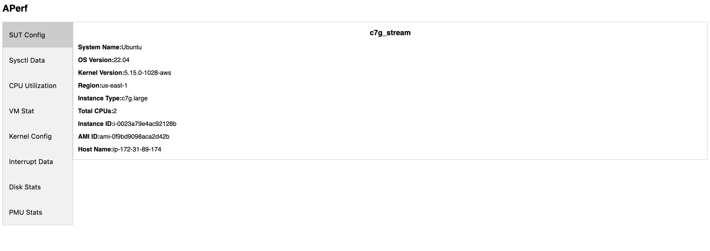
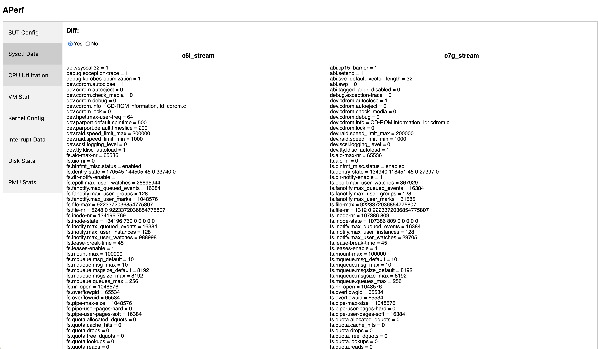
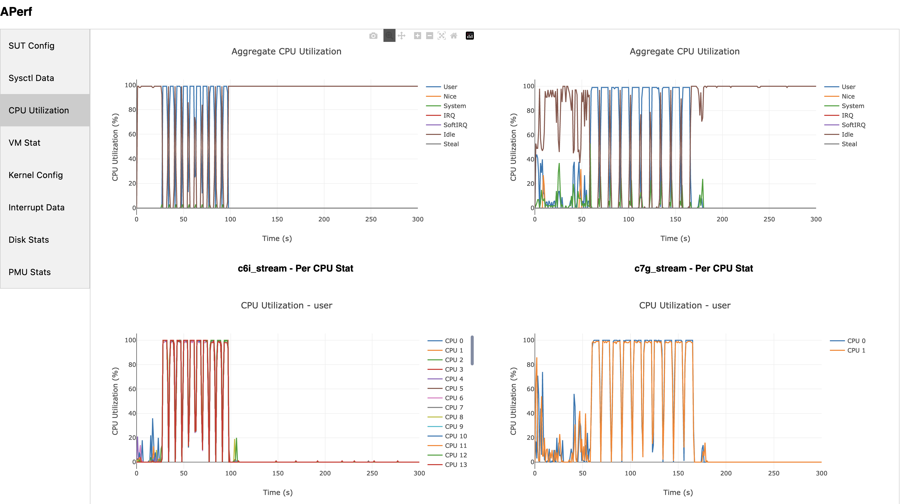
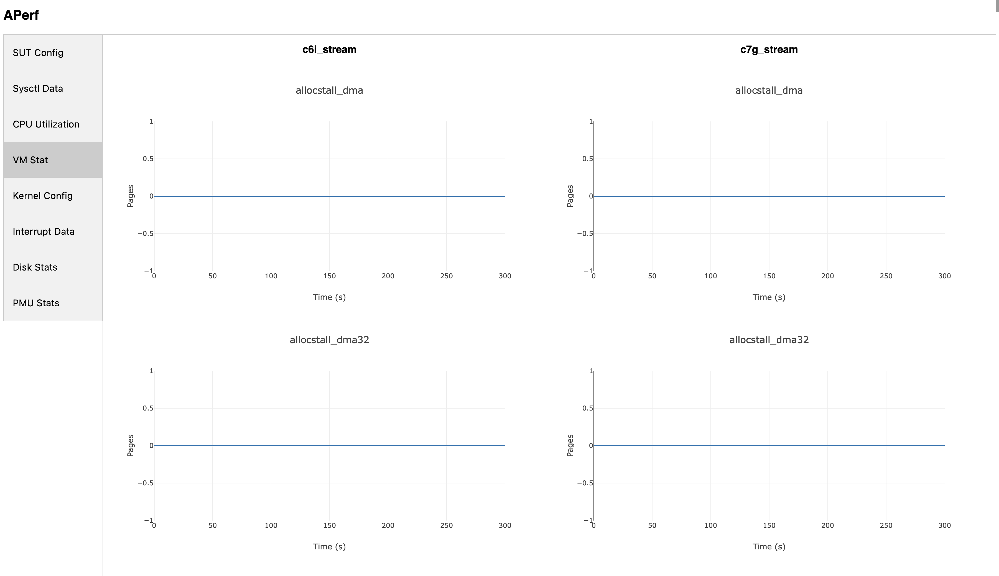
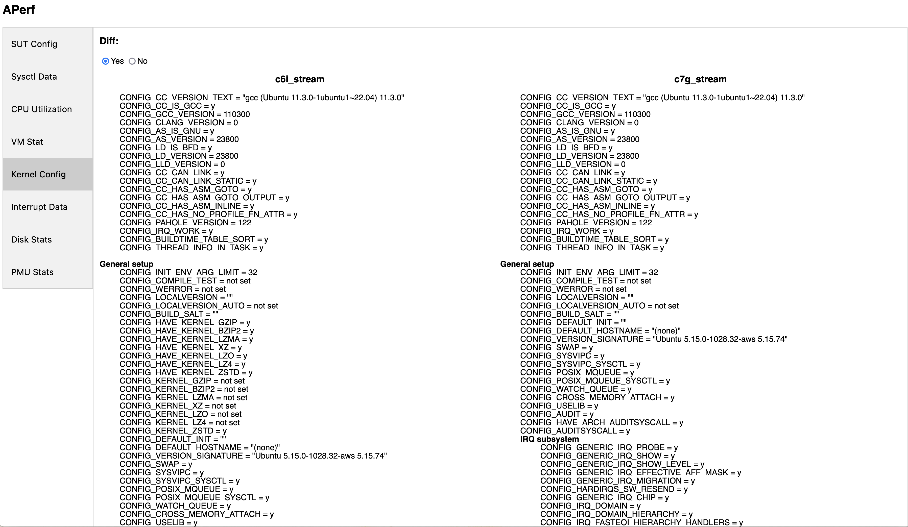
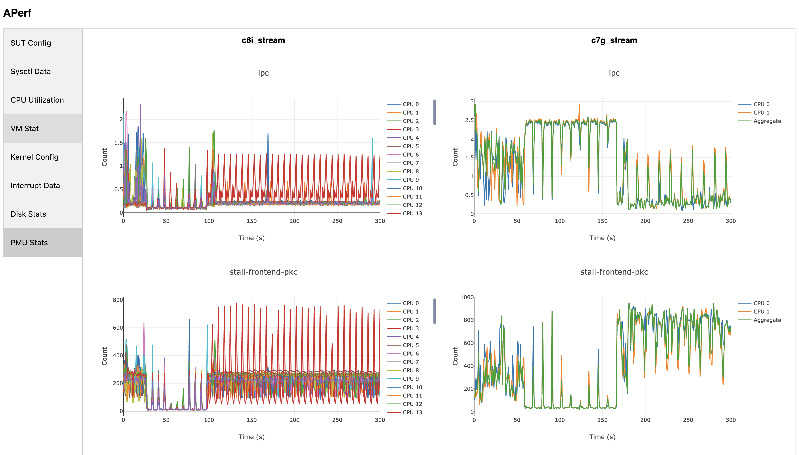
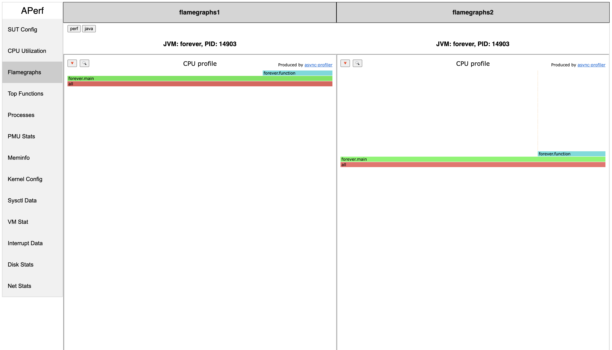

# Example
This guide will show how to run APerf to diagnose your application's performance.

## Download APerf
1. Download the binary from the [Releases](https://github.com/aws/APerf/releases) page.
2. Copy the binary to the host that is running your application.
3. Untar the directory, and place the binary you want it to reside.
```
tar -xvf ./aperf-v0.1.4-alpha-aarch64.tar.gz
```

## Running APerf
For the purpose of this example we will be collecting data on two systems. The first system will be an x86-based C6i system and the second one will be an AWS Graviton C7g instance. To collect performance data in 1 second time intervals for 10 seconds on the C6i instances, run the following command:

```
./aperf-v0.1.6-alpha-x86_64/aperf record -i 1 -p 10 -r c6i_performance_run_1
```

To collect performance data in 1 second time intervals for 10 seconds on the C7g instances, run the following command (note the `run_name` parameter has changed. This allows us to easily differentiate between two performance runs.

```
./aperf-v0.1.6-alpha-aarch64/aperf record -i 1 -p 10 -r c7g_performance_run_1
```

## Visualizing The Results
APerf can be used to generate a report on the data collected. The report contains static HTML and JS files which can be viewed on any system with a web browser. The run data can either be in a directory or in a tarball as generated by the recorder. To generate a report of a single performance run use the following command:

```
./aperf-v0.1.6-alpha-aarch64/aperf report --run c7g_performance_run_1
```

This will generate the report in `aperf_report_c7g_performance_run_1` along with a tarball of the report in `aperf_report_c7g_performance_run_1.tar.gz`.

If the report is to be specifically named, use the following command:

```
./aperf-v0.1.6-alpha-aarch64/aperf report --run c7g_performance_run_1 -n c7g_report
```

This will generate the report in `c7g_report` along with a tarball of the report in `c7g_report.tar.gz`.




## Comparing Two Performance Run Results
To compare the results of two different performance runs, use the following command. This can be useful for comparing differences between systems.

```
./aperf-v0.1.4-alpha-aarch64/aperf report --run-directory c7g_performance_run_1 --run-directory c6i_performance_run_1
```
Here are some example screenshots showing the comparison of two different performance runs on each page:

### Comparing SUT Configs

### Comparing sysctl Configs

### Comparing CPU Utilization Data 

### Comparing VM Stat Data 

### Comparing Kernel Configs

### Comparing PMU Data

### Comparing Flamegraphs
