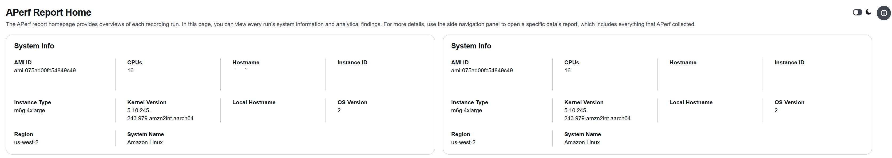
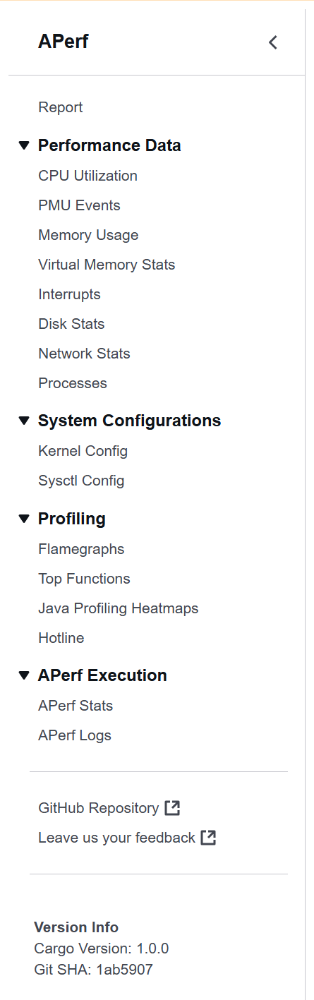
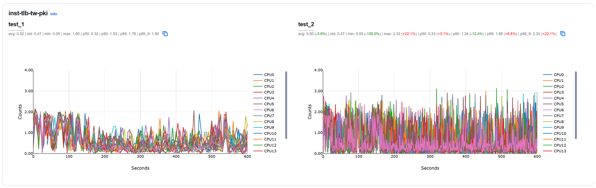
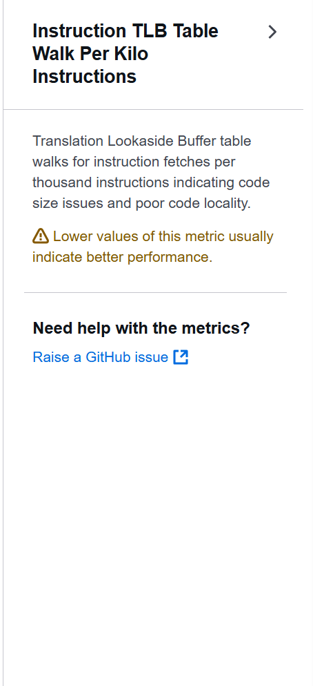

# Example

> [!TIP]
> Check out the APerf guide and demo video at https://www.youtube.com/watch?v=mSrDZuxWFtw

This guide shows examples of using APerf to collect and view system performance data.

## Download APerf
1. Download the latest release of the binary from the [GitHub Releases](https://github.com/aws/APerf/releases) page.
2. Untar the archive to get the APerf binary `aperf`
    ```shell
    tar -xvf ./aperf-v1.0.0-aarch64.tar.gz
    ```
3. Move the binary to the host where the target application is running.

## Optional: Download Dependencies
1. To use the `--profile` option, install the `perf` binary on the host.
2. To use the `--profile-java` option, install JDK (ensure that the `jps` binary is available on PATH) and [async-profiler](https://github.com/async-profiler/async-profiler/tree/master) on the host.

See [DEPENDENCIES.md](./DEPENDENCIES.md) for more details.

## Record Performance Data
To start collecting performance data, run the `aperf record` command. The below example starts an APerf record run named "test_1" that runs for 10 minutes, collects data once per 5 seconds, gather perf profiles, and enables Java profiling for JVMs with PID 12345 and 23456:
```shell
aperf record -r test_1 -p 600 -i 5 --profile --profile-java 12345,23456
```
After the recording is complete, the collected raw data are available in the directory "test_1" and the tar ball "test_1.tar.gz".

## Create APerf Report
To view the recorded data, run the `aperf report` command. The below example generates a report named "test_1_report" for the previously record run "test_1", assuming that we are at the same path as the record archive or directory:
```shell
aperf report -r test_1 -n test_1_report
```
The command works the same if the input is a path to the tar ball:
```shell
aperf report -r ../test_1.tar.gz -n test_1_report
```
The command generates a directory "test_1_report" and a tar ball "test_1_report.tar.gz" that both contain the report files.

Assume there is another record run "test_2" that we want to compare against "test_1". The below example generates a report that include both runs in a single report named "test_report":
```shell
aperf report -r test_1 test_2 -n test_report
```
Similarly, the command generates the report in the directory "test_report" and tar ball "test_report.tar.gz".

## View APerf Report
To view an APerf report, move the report to an environment where a browser is available and open the "index.html" file. The below examples walk through the "test_report" generated above.

The report homepage contains the system information for each record run:



Use the navigation panel on the left side to view different data:



For time series data, same metric across different runs are placed together for easy comparison. The stats of each metric are shown above the graph, and for runs other than the base run, the stats are compared against those of the base run. If the delta is green, it means the stat is more desired than the base run; if the delta is red, it means the stat is less desired:



Click the info button of each metric to learn more about the metric, its desired value, and how it could impact performance:


